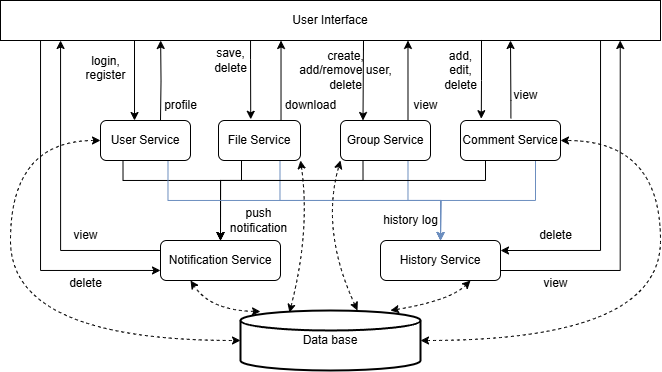

# TnT Dropbox
Projekt TnT Dropbox je zasnovan za reševanje težav pri varnem in učinkovitem shranjevanju, deljenju in upravljanju datotek v digitalnem okolju. Uporabniki pogosto potrebujejo platformo, ki omogoča preprosto sodelovanje, sledenje in nadzor nad dostopom do datotek, hkrati pa zagotavlja varnost in enostaven dostop kjerkoli in kadarkoli. Naša rešitev ponuja robustno aplikacijo, ki temelji na mikrostoritvah, s funkcijami za shranjevanje ter upravljanje datotek, obvestila, sledenje aktivnosti in sodelovanje.
## Shema arhitekture


## Načrt mikrostoritev in REST API končnih točk
- **User Service:**
    - `GET /users` – Vrne seznam vseh uporabniških profilov. (samo admin)
    - `GET /users/{id}` – Vrne podatke o določenem uporabniku glede na ID.
    - `POST /users/register` – Ustvari nov uporabniški profil (registracija).
    - `POST /users/login` – Prijava uporabnika v sistem.
    - `PUT /users/{id}` – Posodobi podatke obstoječega uporabnika glede na ID. (sprememba gesla, ...)
    - `DELETE /users/{id}` – Izbriše uporabniški profil na podlagi ID-ja.
  
- **File Service:**
    - `GET /files/user/{userId}` – Vrne seznam vseh datotek (prijavljenega uporabnika).
    - `GET /files/group/{GrId}` – Vrne seznam vseh datotek določene skupine uporabnikov.
    - `GET /files/{id}` – Vrne datoteko glede na ID.
    - `POST /files` – Shrani novo datoteko.
    - `POST /files/{fileId}/groups/{GrId}` – Shrani datoteko v določeno skupino.
    - `PUT /files/{id}` – Posodobi datoteko.
    - `DELETE /files/{id}` – Izbriši datoteko.
  
- **Group Service:**
    - `GET /groups` – Vrne seznam vseh skupin (prijavljenega uporabnika).
    - `GET /groups/{id}` – Vrne podatke o posamezni skupini.
    - `GET /groups/{id}/members` – Vrne člane posamezne skupine.
    - `POST /groups` – Ustvari skupino.
    - `PUT /groups/{id}` – Posodobi podatke o skupini.
    - `PUT /groups/{id}/add/{userId}` – doda novega uporabnika v skupino.
    - `DELETE /groups/{id}` – Izbriši skupino.
    - `DELETE /groups/{id}/remove/{id}` – odstrani uporabnika iz skupine.
  
- **Comment Service:**
    - `GET /comments/group/{GrId}` – Vrne seznam komentarjev določene skupine.
    - `POST /comments/group/{GrId}` – Dodaj komentar v skupino.
    - `PUT /comments/{id}` – Uredi komentar.
    - `DELETE /comments/{id}` – Izbriši komentar.
  
- **Notification Service:**
    - `GET /notifications` – Vrne seznam obvestil (prijavljenega uporabnika).
    - `GET /notifications/{id}` – Vrne vsebino obvestila.
    - `POST /notifications/{UserID}` – Pošlji obvestilo določenemu uporabniku (admin / mikrostoritev).
    - `DELETE /notifications` – Izbriši vsa prejeta obvestila uporabnika.
    - `DELETE /notifications/{id}` – Izbriši določeno obvestilo.
  
- **History Service:**
    - `GET /logs/user/{id}` – Vrne seznam zapisov dogodkov določenega uporabnika.
    - `GET /logs/{id}` – Podrobnosti posameznega zapisa.
    - `POST /logs` – Ustvari nov zapis.

## Načrt baze podatkov


## Navodila za zagon
### Lokalno
Zaženete lahko posamezne mikrostoritve tako da izberete ustrezen profil:
- Mikrostoritev **user** se zažene na portu **8081**:
    ```cmd
    mvn spring-boot:run "-Dspring-boot.run.profiles=user"
    ```
- Mikrostoritev **file** se zažene na portu **8082**:
    ```cmd
    mvn spring-boot:run "-Dspring-boot.run.profiles=file"
    ```
- Mikrostoritev **group** se zažene na portu **8083**:
    ```cmd
    mvn spring-boot:run "-Dspring-boot.run.profiles=group"
    ```
- Mikrostoritev **comment** se zažene na portu **8084**:
    ```cmd
    mvn spring-boot:run "-Dspring-boot.run.profiles=comment"
    ```
- Mikrostoritev **notification** se zažene na portu **8085**:
    ```cmd
    mvn spring-boot:run "-Dspring-boot.run.profiles=notification"
    ```
- Mikrostoritev **history** se zažene na portu **8086**:
    ```cmd
    mvn spring-boot:run "-Dspring-boot.run.profiles=history"
    ```
Testno lahko zaženete tudi vse storitve skupaj:
- Testna verzija teče na portu **3000**:
    ```cmd
    mvn spring-boot:run "-Dspring-boot.run.profiles=test"
    ```

### Docker
Najprej v korenski mapi poženite naslednji ukaz:
```cmd
mvn clean install
```
Nato se premaknite v mapo docker
```cmd
cd docker
```
Po želji lahko ročno zgradite in zaženete docker slike ločeno za vsako storitev posebaj:
- **user**
    ```cmd
    docker build -t user_service -f user/Dockerfile ..
    docker run -d --name user_service_container -p 8081:8081 user_service
    ```
- **file**
    ```cmd
    docker build -t file_service -f file/Dockerfile ..
    docker run -d --name file_service_container -p 8082:8082 file_service
    ```
- ... podobno tudi za ostale storitve oz. docker datoteke

Enostavno lahko zgradite in poženete vse docker slike naenkrat z ukazom:
```cmd
docker compose up --build
```
Vse docker slike so dostopne tudi v Docker-Hub [repozitoriju](https://hub.docker.com/repository/docker/tcerne/tntdropbox)
